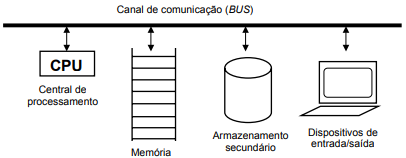

## **Aula 01**

Nessa aula será abordado um pouco sobre C Moderno. Deve-se entender como funciona a linguagem e a diferença entre uma linguagem compilada e uma linguagem interpretada.

Durante esse curso de C Moderno, vamos editar os códigos utilizando o editor de texto VIM (Vi IMproved) em um ambiente Arch Linux, contudo, vc não precisa ter um ambiente idêntico. Basta ter um sistema operacional e um editor de texto de prefêrencia, não podendo ser um editor com formatação de caracteres, tipo **Microsoft Word**.

Nessa pasta, haverá um primeiro programa em C comentado, contendo um **HELLO WORLD**. E para os usuários de VIM, será disponibilizado um arquivo **.vimrc** que contém as configurações do VIM que estou utilizando e pode facilitar durante a codificação. Para quem já possui seu próprio arquivo .vimrc não precisa utilizar o meu.
Para que seja possível utilizar o .vimrc, ele deve ser copiado para ~/.vimrc ou $HOME/.vimrc e para isso pode ser utilizado no Linux, o seguinte comando:
`cp .vimrc ~/.vimrc`

### **Modelo de um computador**
Acredito que você que está aqui, já deve saber como funciona um computador, mas abaixo, deixarei um modelo básico de computador.

### **Compilada ou Interpretada?**
Uma linguagem interpretada, ela precisa de um programa interpretador, ou seja, que faça a leitura do código escrito e que durante a solicitação, faça a transcrição para a linguagem de máquina, para que a máquina possa interpretada e executar o código. Em caso de erro, o interpretador apresentará na tela, caso contrário, ele sucederá e imprimirá o código escrito. Um exemplo atual de linguagem interpretada é o Python.

No nosso caso, o C é uma linguagem compilada, sendo assim, para executarmos o código, precisaremos de um programa compilador, que vai receber como entrada nosso código escrito em C e vai transofmrar em linguagem de máquina, gerando um objeto (.o ou .obj), e após isso, vai fazer uma ligação (link) para gerar o executável.

### **Hello World**
Nosso primeiro programa em C, será o bom e velho Hello World (quem aprendeu outras linguagens, sabe o que estou falando), para isso, a estrutura do programa consistira em:
* Inclusão da módulo stdio.h que contém o printf, para isso, utilizaremos a função interna do C, `#include` para utilizarmos do módulo no código.
* Criar a função obrigatória `main`, que contém o código Hello World.
* Retornar com 0, isso quer dizer, que ao finalizar nosso programa, ele retornará que foi sucesso. Existe outros códigos de retorno em C, como 1 e 2, para mal-sucesso ou erro.
* Após isso, vamos fechar nossa função, salvar nosso programa e compilar.
* Para compilar, utilizaremos o Gnu C Compiler (gcc), através do seguinte código:
`gcc -c main.c && gcc main.o -o main`
* Aí vai uma dica. Podemos utilizar o utilitário Make, sem um Makefile, apenas informando o nome do projeto, como por exemplo:
`make main`
* E por último e não menos importante, devemos rodar nosso programa, no Linux, devemos passar o caminho completo até o executável, para poder executá-lo. Mas no Linux existe um atalho para passar a pasta atual do programa e não precisar escrever todo o caminho completo, conforme a seguir:
`./main`
